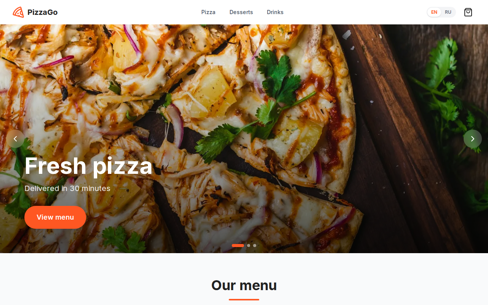
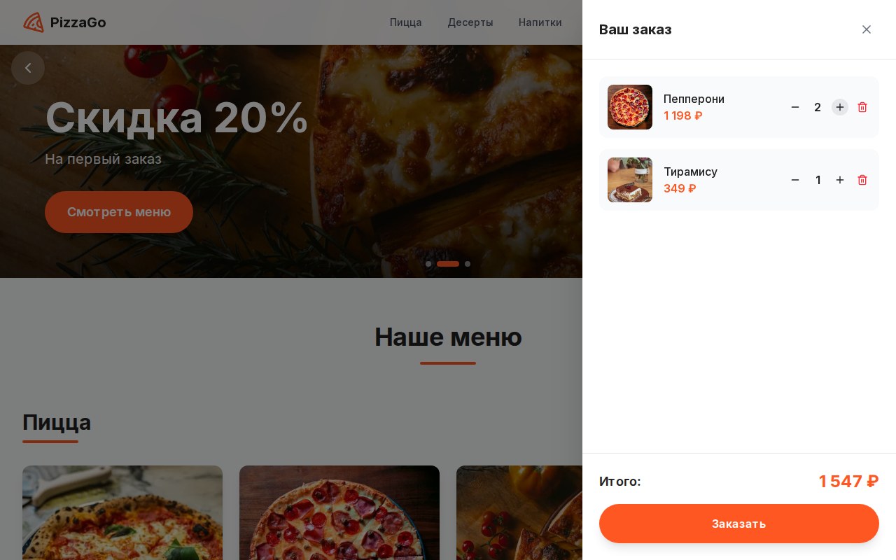
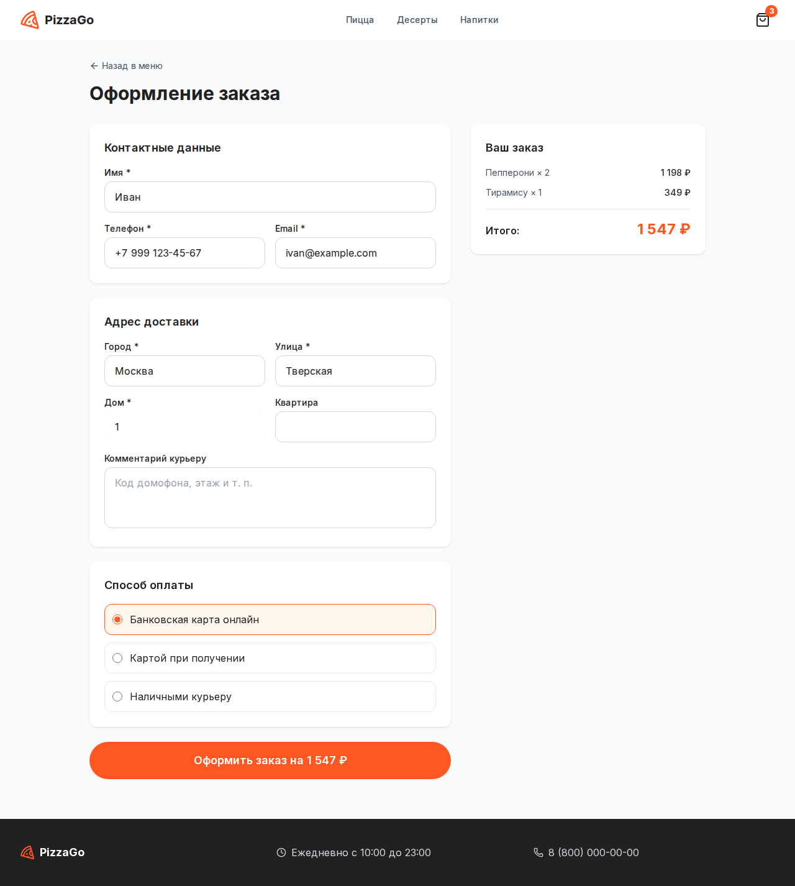
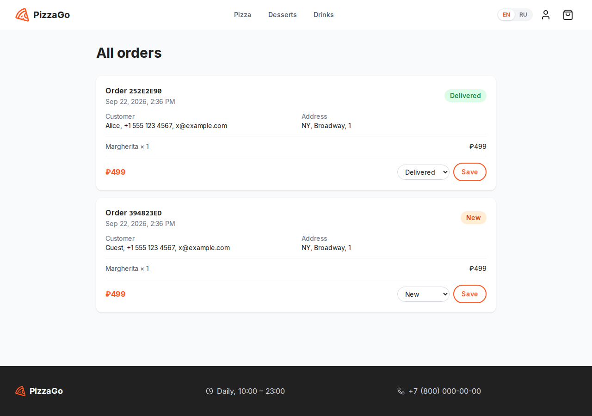

# PizzaGo

**English** | [Русский](README.ru.md)

[](https://github.com/Kupy4a/PizzaGo/actions/workflows/ci.yml)

**[Live demo →](https://pizza-go-flame.vercel.app)**

A pizza delivery storefront: menu by category, cart, checkout, customer accounts with order history and an admin panel for managing orders. The interface is available in English and Russian.



## Features

**Storefront**
- Promo slider, menu grouped by category, product modal, slide-over cart
- English / Russian interface with a switcher in the header; the choice is remembered in a cookie
- The cart is saved in `localStorage` and survives page reloads
- Checkout validated in the browser and on the server; `POST /api/orders` recalculates the total from the catalog and never trusts prices sent by the client
- Responsive layout, Esc closes dialogs, labelled controls for screen readers

**Accounts and orders (Supabase)**
- Sign up and sign in with email and password
- "My orders" page with the status of every order placed while signed in
- Admin panel: all orders with customer details and a status switcher (New → Cooking → Delivered / Cancelled)
- Access is enforced by PostgreSQL row-level security, not just by the UI: customers only see their own orders, only admins can change statuses

Supabase is optional. Without it the shop still works and stores orders in `.data/orders.json`; account pages are hidden.

| Cart | Checkout | Admin panel |
|---|---|---|
|  |  |  |

## Tech stack

Next.js 16 (App Router, Server Actions) · React 19 · TypeScript · Tailwind CSS 4 · Framer Motion · Zustand · Supabase (Postgres, Auth, RLS) · Vitest · Playwright · GitHub Actions

## Getting started

Requires Node.js 20.19 or newer (22 LTS recommended).

**Windows:** double-click `run.cmd` or run it from a terminal.

**Linux / macOS:**

```bash
./run.sh
```

The launcher checks the Node.js version, installs dependencies on the first run and starts the dev server at http://localhost:3000. Pass `prod` to build and run the production version: `run.cmd prod` or `./run.sh prod`.

Dependencies include native binaries built for one operating system. If you open the same folder from Windows and from WSL/Linux, the launcher notices that `node_modules` belongs to the other system and reinstalls it.

You can also use npm directly:

```bash
npm install
npm run dev
```

## Supabase setup

**Cloud (free tier):**

1. Create a project at [supabase.com](https://supabase.com).
2. Open *SQL Editor* and run the files from [`supabase/migrations`](supabase/migrations) in order: first `…_init.sql`, then `…_grants.sql`.
3. Click *Connect* at the top of the project page, choose *App Frameworks → Next.js* and copy the two `NEXT_PUBLIC_…` lines into `.env.local` (see `.env.example`).
4. In *Authentication → URL Configuration* set *Site URL* to your site address (for example `http://localhost:3000`).

**Local (Docker):** `npx supabase start` launches Supabase with the migration applied; `npx supabase status` prints the URL and key for `.env.local`.

**Making someone an admin:** after the user has signed up, run in the SQL Editor:

```sql
insert into admins (user_id) select id from auth.users where email = 'you@example.com';
```

An "Admin panel" link then appears on their "My orders" page.

## Deploying to Vercel

[Vercel](https://vercel.com) is a hosting service from the authors of Next.js with a free plan for personal projects.

1. Sign in to Vercel with your GitHub account and click *Add New → Project*.
2. Import the `PizzaGo` repository; the Next.js settings are detected automatically.
3. Under *Environment Variables* add the same two variables as in `.env.local` (`NEXT_PUBLIC_SUPABASE_URL` and `NEXT_PUBLIC_SUPABASE_PUBLISHABLE_KEY`), then click *Deploy*.
4. Put the resulting `https://….vercel.app` address into Supabase *Site URL*.

Every push to `main` redeploys the site. Without Supabase the demo still works, but orders are kept only in temporary storage.

A free Supabase project is paused after a week without activity. [`vercel.json`](vercel.json) schedules a daily Vercel cron job that calls `/api/health`, which runs a small database query and keeps the project awake.

## Tests

| Command | What it runs |
|---|---|
| `npm test` | unit tests (Vitest): order validation, cart, translations |
| `npm run test:e2e` | end-to-end tests (Playwright): builds the app and walks through ordering in a real browser |
| `npm run typecheck` | TypeScript |
| `npm run lint` | ESLint |

Before the first e2e run, install the browser: `npx playwright install chromium`.

GitHub Actions runs all of them on every push and pull request.

## Project structure

```
app/
  page.tsx               home page: slider and menu
  checkout/  success/    ordering flow
  login/  account/       sign-in and "My orders"
  admin/                 admin panel and status Server Action
  api/orders/            order creation endpoint
components/              UI components
lib/
  i18n/                  locales, dictionaries, language context
  supabase/              Supabase clients for server and browser
  menu.ts                product catalog in both languages
  order.ts               order validation and total calculation
  cart-store.ts          cart state (Zustand + persist)
proxy.ts                 refreshes the Supabase session cookie
supabase/migrations/     database schema, RLS policies, seed data
tests/unit/  tests/e2e/  Vitest and Playwright tests
scripts/start.mjs        cross-platform launcher
```
