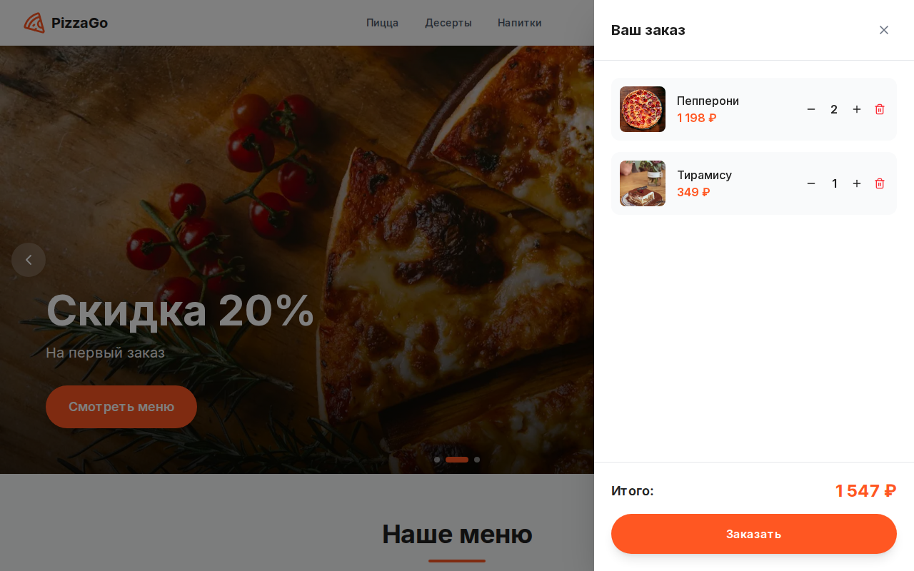
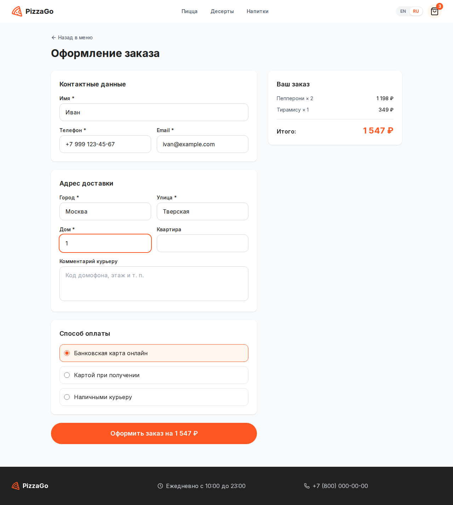

# PizzaGo

[English](README.md) | **Русский**

Интернет-магазин доставки пиццы: меню по категориям, карточка товара, корзина и оформление заказа. Интерфейс доступен на английском и русском.


## Возможности

- Слайдер акций с автопрокруткой, паузой при наведении и ручным переключением
- Меню по категориям (пицца, десерты, напитки) с плавной прокруткой из шапки
- Модальное окно товара, выдвижная корзина, счётчик товаров в шапке
- Английский и русский интерфейс с переключателем в шапке; выбор запоминается в cookie
- Корзина сохраняется в `localStorage` и переживает перезагрузку страницы
- Оформление заказа с проверкой полей в браузере и на сервере
- API `POST /api/orders` сам пересчитывает сумму по каталогу, цены с клиента не принимаются
- Заказы сохраняются в Supabase, а если он не настроен, в локальный файл `.data/orders.json`
- Адаптивная вёрстка, закрытие окон по Esc, подписи для экранных дикторов

| Корзина | Оформление заказа |
|---|---|
|  |  |

## Стек

Next.js 16 (App Router) · React 19 · TypeScript · Tailwind CSS 4 · Framer Motion · Zustand · Supabase

## Запуск

Нужен Node.js 20.9 или новее (рекомендуется 22 LTS).

**Windows:** дважды щёлкните `run.cmd` или запустите его из терминала.

**Linux / macOS:**

```bash
./run.sh
```

Скрипт проверяет версию Node.js, при первом запуске ставит зависимости и запускает сервер разработки на http://localhost:3000. С параметром `prod` собирается и запускается production-версия: `run.cmd prod` или `./run.sh prod`.

В зависимостях есть бинарные модули под конкретную ОС. Если открывать одну и ту же папку то из Windows, то из WSL/Linux, скрипт заметит, что `node_modules` установлены под другую систему, и переустановит их.

Можно запускать и через npm напрямую:

```bash
npm install
npm run dev
```

### Supabase (необязательно)

1. Создайте проект в Supabase и выполните [`supabase/schema.sql`](supabase/schema.sql) в SQL Editor: он создаёт таблицы, политики RLS и наполняет меню.
2. Скопируйте `.env.example` в `.env.local` и укажите URL проекта и anon key.

## Скрипты

| Команда | Что делает |
|---|---|
| `npm run dev` | сервер разработки |
| `npm run build` | production-сборка |
| `npm start` | запуск собранного приложения |
| `npm run lint` | ESLint |
| `npm run launch` | то же, что `run.cmd` / `run.sh` |

## Структура

```
app/
  page.tsx            главная: слайдер и меню
  checkout/           оформление заказа
  success/            страница «заказ принят»
  api/orders/         API создания заказа
components/           UI-компоненты (корзина, карточки, модалки, шапка, переключатель языка)
lib/
  i18n/               языки, словари, контекст языка
  menu.ts             каталог товаров и баннеры на двух языках
  order.ts            валидация заказа и пересчёт суммы
  cart-store.ts       состояние корзины (Zustand + persist)
scripts/start.mjs     кроссплатформенный скрипт запуска
supabase/schema.sql   схема базы данных
```
